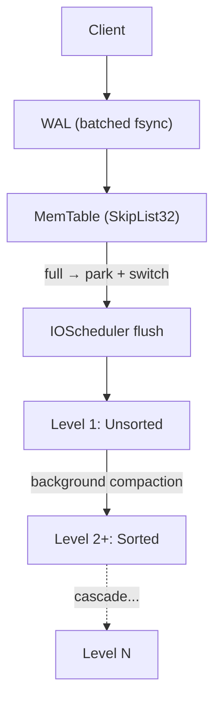
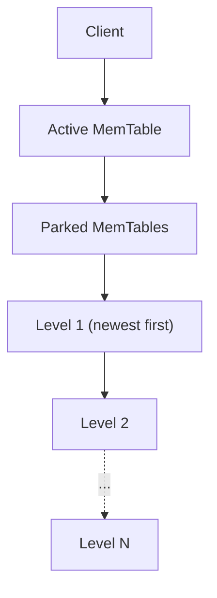
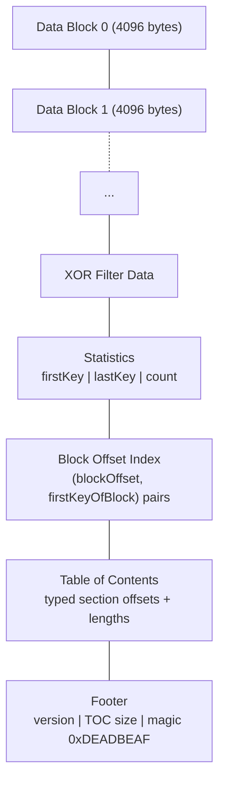
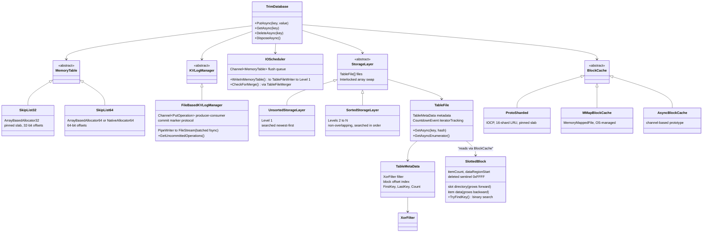

# TrimDB

**An embeddable, transactional, concurrent key-value store for .NET - built from scratch in C#.**

TrimDB fills a genuine gap in the .NET ecosystem. Go developers reach for Badger. C++ developers reach for RocksDB. .NET developers have historically had to P/Invoke into native binaries, accept cross-language debugging overhead, and manage native dependency deployment across platforms. TrimDB makes that compromise unnecessary.

It is a Log-Structured Merge-Tree (LSM) storage engine - the same foundational architecture behind LevelDB, RocksDB, Cassandra, and Badger - implemented entirely in modern C# with no native binaries, no P/Invoke at the hot path, and no external processes.

```csharp
var options = new TrimDatabaseOptions { DatabaseFolder = "./mydb" };
await using var db = await TrimDatabase.OpenAsync(options);

await db.PutAsync(key, value);
var value = await db.GetAsync(key);
await db.DeleteAsync(key);
```

---

## Why TrimDB?

The .NET runtime has reached a level of performance maturity where it is viable to build system-level storage primitives in managed code. TrimDB is a proof of that claim and a practical tool for developers who need:

- **Embedded storage with no external dependencies** - no server process, no sockets, no config files. The database opens in your process and closes with `DisposeAsync`.
- **Durability without ceremony** - writes are protected by a write-ahead log (WAL). Any `PutAsync` that returns has survived to the OS file system.
- **Concurrent, transactional semantics** - multiple threads can read and write simultaneously. The design is lock-free at the memory layer and uses fine-grained sharding at the cache layer.
- **Pure .NET** - written with `Span<T>`, `Memory<T>`, `System.IO.Pipelines`, `System.Threading.Channels`, `IAsyncEnumerable<T>`, `ValueTask`, and unsafe code for hot paths. It uses the full modern .NET API surface, not a subset.

---

## Architecture

TrimDB is a five-level LSM engine. Understanding the data lifecycle through those levels is the key to understanding the entire system.

### The Write Path

Every write passes through three stages before it is considered durable:

1. **WAL** - the operation is serialized to a `PipeWriter` channel and flushed to disk (one `fsync`-equivalent per batch of concurrent writes)
2. **MemTable** - the key-value pair is inserted into a lock-free skip list backed by a pre-allocated slab
3. **SSTable** - when the MemTable is full, a background flush serializes it to an immutable `.trim` file on disk

**Write path:**



**Read path:**



Reads always consult layers from newest to oldest and short-circuit the moment a definitive answer is found - either a value or a tombstone.

---

### Five-Layer Architecture

| Layer | Structure | Role |
|---|---|---|
| MemTable | SkipList32 on a pinned slab | In-memory write buffer, lock-free O(log n) ops |
| WAL | Channel + PipeWriter | Durable write record, crash recovery |
| Level 1 | UnsortedStorageLayer | Freshly flushed SSTables, may overlap |
| Level 2–N | SortedStorageLayers | Non-overlapping SSTables, background-compacted |
| BlockCache | ProtoSharded / MMapBlockCache | Shared, sharded cache over all SSTable data blocks |

---

### The MemTable: Slab-Allocated Skip List

The active write buffer is a skip list - the canonical choice for LSM engines (used identically in LevelDB, RocksDB, and Badger) because it supports O(log n) search, insertion, and forward iteration while admitting lock-free concurrent access more naturally than balanced trees.

TrimDB's skip list is unusual in one important way: it does not allocate individual heap objects for nodes. Instead, every node is carved out of a single pre-allocated, GC-pinned `byte[]` slab. This has consequences that compound across the entire system:

- **GC pressure eliminated** - the slab is allocated once at startup and pinned. The GC's reference-scanning pass never touches node objects. Write bursts do not translate into GC pauses.
- **Cache locality** - node key bytes are embedded inline in the slab allocation. Skip list pointer traversals tend to land in recently-paged memory regions.
- **Deterministic capacity** - when the slab is exhausted, `Put` returns `false` synchronously. `TrimDatabase` atomically switches to a pre-allocated fresh MemTable. There is no dynamic resizing and no ambiguity about when a flush is needed.
- **Cache-line alignment** - allocations are padded to 64-byte boundaries. No two nodes share a cache line; there is no false sharing under concurrent writes.

The node layout for the 32-bit variant:

```
| Node Length (32 bits) | Table Height (8 bits) | Reserved (24 bits) |
| Value Pointer (32 bits)                                              |
| List Pointer [level 0] (32 bits)                                    |
| List Pointer [level h] (32 bits)                                    |
| Key Data (variable)                                                  |
```

Insertions use `Interlocked.CompareExchange` to install pointer links level by level. Deletes mark the value pointer with a sentinel bit pattern (`0xF000_0000`) rather than structurally unlinking the node. Node heights are generated from leading-zero counts in a random number, giving O(log n) expected height growth without coordination between concurrent inserters.

Two variants exist: `SkipList32` (32-bit offsets into a `byte[]`, current default) and `SkipList64` (64-bit offsets, with both `ArrayBasedAllocator64` and `NativeAllocator64` backends that were benchmarked against each other).

---

### The Write-Ahead Log

`FileBasedKVLogManager` is a producer-consumer channel where all write operations are the producers and a single background consumer serializes them to disk.

**Wire format for a data entry:**

```
| keyLength (4 bytes) | key (N bytes) | deleted (1 byte) | valueLength (4 bytes) | value (M bytes) |
```

**Wire format for a commit marker:**

```
| sentinel (4 bytes = -2) | committedUpToOffset (8 bytes) |
```

The channel design means the consumer can drain an entire batch of concurrent writes, serialize them all into the `PipeWriter` buffer, issue a single `FlushAsync` (one OS-level flush), and acknowledge all of them in one pass. This is group commit - the same technique used by PostgreSQL - and it means `fsync` cost is amortized across all concurrent writers rather than paid per operation.

`WalWaitForFlush` is a configurable option: wait for OS acknowledgment for strict durability, or skip the wait for maximum throughput at the cost of a small durability window.

**Crash recovery**: On `OpenAsync`, `TrimDatabase.ReplayWalAsync` reads from the last commit marker forward, replaying all unacknowledged operations into a fresh MemTable. After replay, normal operation resumes with full consistency. When the IOScheduler successfully flushes a MemTable to disk, it records the MemTable's `WalHighWatermark` as a new commit marker, bounding future recovery work.

---

### SSTable Files

When the IOScheduler flushes a MemTable, it writes a `.trim` file with this on-disk layout:



The 4096-byte block size is a deliberate choice: it matches the OS page size. When SSTable files are accessed via memory-mapped I/O, each block maps to exactly one OS page, eliminating partial-page reads and making the mapping from block ID to byte offset trivial arithmetic.

**Slotted block format**: Within each 4096-byte block, TrimDB uses a slotted-page layout:

```
| Header: itemCount (2 bytes) | dataRegionStart (2 bytes)  |
| Slot Directory → growing forward                          |
|   { dataOffset (2 bytes), keyHash (2 bytes) } per entry  |
| Free Space                                                |
| ← Item Data growing backward                             |
|   { keyLen (2), valueLen (2), key bytes, value bytes }   |
```

The slot directory is kept in key-sorted order and stores a 16-bit FNV-1a key hash alongside each slot offset. `TryFindKey` binary-searches the slot directory, uses the embedded hash as a quick reject before full key comparison, and only reads item data when the hash matches. This layout is cache-efficient in both directions: forward iteration walks the slot directory sequentially; random lookup binary-searches the directory before loading the item region from the back of the block. Deleted entries use sentinel value `0xFFFF` in the `valueLen` field.

**Table of Contents and lazy loading**: On file open, only the footer page (4096 bytes) is read. The TOC within it lists typed sections (Filter, Statistics, BlockOffsets) with their offsets and sizes, enabling direct seeks to each section. Data blocks are never loaded at open time; they are loaded on demand through the block cache.

**Block offset index**: The Statistics section contains a sorted `(blockOffset, firstKeyOfBlock)` list. `FindContainingBlock` binary-searches this list to locate the relevant block in O(log K) time, where K is the number of blocks in the file.

---

### The XOR Filter

Before performing any binary search on SSTable blocks, each lookup first consults an XOR filter. The XOR filter is a probabilistic data structure that answers "is this key definitely absent from this file?" with zero false negatives. It achieves approximately 8 bits per key at a ~0.4% false positive rate - roughly 20% more space-efficient than a standard Bloom filter at equivalent accuracy.

Construction peels an XOR graph over all keys (similar to belief propagation), assigning 8-bit fingerprints to a table of length `1.23 * n`. Lookup checks three positions derived from the key's MurmurHash3 64-bit hash (via bit rotation) and verifies that their XOR equals the expected fingerprint.

TrimDB uses MurmurHash3 (128-bit, x64 variant) as the primary hash function, implemented as a hand-written unsafe C# port of the reference C++ implementation with identical constants and mixing rounds.

If the filter returns absent, `GetAsync` returns immediately without touching any data block. In systems with dozens of SSTable files across levels, this is the difference between O(1) and O(K) disk reads for keys that do not exist.

---

### The Block Cache

All SSTable data block reads go through the `BlockCache` abstraction. Three implementations exist:

**ProtoSharded** (production default): A 16-shard LRU cache backed by a single pinned `byte[]` slab. Blocks are assigned to shards by hash of `(fileId, blockId)`, distributing lock contention across shards. I/O is performed via Windows I/O Completion Ports (IOCP): files are opened with `FILE_FLAG_OVERLAPPED`, read operations are posted to the completion port, and a pool of background threads (one per logical CPU) drain the completion queue. This achieves true kernel-level async I/O rather than relying on .NET's thread-pool-based `FileStream.ReadAsync`.

**MMapBlockCache**: Memory-maps each SSTable file using `MemoryMappedFile`. Reads become pointer arithmetic into the mapped view; the OS manages physical page residency. Simpler than ProtoSharded and may outperform it under workloads with strong spatial locality.

**AsyncBlockCache**: A prototype using `System.Threading.Channels` for I/O scheduling, representing an async-native I/O exploration.

The `BlockCache` abstraction in `TrimDatabaseOptions` lets the caller choose the appropriate backend for their environment and workload. Future backends (such as `io_uring` on Linux) could be added without touching the engine.

---

### Flush and Compaction: The IOScheduler

`IOScheduler` runs two concurrent background loops driven by `Channel<MemoryTable>` and `SemaphoreSlim` respectively.

**Flush loop** (`WriteInMemoryTable`): Reads parked MemTables from the flush channel, serializes each to a Level 1 `.trim` file via `TableFileWriter`, registers the file with the block cache, removes the MemTable from the database's old-table list, checkpoints the WAL, and signals the compaction loop.

**Compaction loop** (`CheckForMerge`): Wakes when the flush loop signals. Inspects all layers and triggers merges wherever a layer holds more than 80% of its file-count capacity. Keeps merging until no layer needs compaction, so a single flush burst does not accumulate cascading compaction debt.

**Level 1 merge strategy**: The oldest file in the unsorted layer is merged with all overlapping files from Level 2. New Level 2 files are produced; consumed files are removed from both layers atomically.

**Level 2+ merge strategy**: The file with the fewest overlaps in the level below is selected first. If a file has zero overlaps, it is moved down without merging. Otherwise, `TableFileMerger` feeds the file and all overlapping files from the next level through a k-way merge, producing new files in the destination layer.

**k-way merge** (`TableFileMerger`): Each `MoveNextAsync` selects the iterator pointing to the globally smallest key. When multiple iterators point to the same key (a duplicate from overlapping files), all but the first (the newest by convention) are advanced and skipped. This is the LSM reconciliation step: newer data wins.

**Atomic file-list swap**: After a merge completes, the new `TableFile[]` is installed via `Interlocked.CompareExchange` on the layer's array reference. Readers holding a reference to the old array continue reading from the old files. Files are not deleted from disk until all iterators referencing them complete, enforced by a `CountdownEvent` per file initialized to 1 and incremented by each `GetAsyncEnumerator` call.

---

## Technical Advantages

### Zero-Allocation Hot Path for Reads

When a key is found in the active MemTable, `GetAsync` returns via `ReadOnlySpan<byte>` pointing directly into the slab. No allocation occurs on the read path for in-memory hits. For read-heavy workloads with a working set that fits in memory, this is a material advantage over any implementation that wraps values in heap-allocated objects.

### XOR Filter Over Bloom Filter

The XOR filter provides approximately 20% better space efficiency than a standard Bloom filter at the same false positive rate. Across a system that may hold dozens of SSTable files across multiple levels, each with its own filter, this compounds into a significant reduction in both memory footprint and unnecessary block cache loads for point lookups on absent keys.

### Slab Allocator Eliminates GC Interference

The MemTable's pinned slab means GC collections never pause skip list operations. The GC's reference-scanning traversal never touches individual node objects. Memory pressure from write bursts does not manifest as read latency spikes. This mirrors techniques used in production systems such as Microsoft FASTER and is a genuine engineering advantage over any object-graph skip list implementation.

### Amortized WAL Flushing (Group Commit)

The channel-based WAL consumer naturally batches concurrent writers. A single `fsync` covers every write that arrived during the consumer's current drain cycle. In a system with N concurrent writers, this means N-times the write throughput with no per-write durability compromise - the same technique PostgreSQL calls group commit.

### Lock-Free MemTable Switching

When a MemTable fills, `TrimDatabase` installs a pre-allocated replacement via `Interlocked.Exchange`. Writers blocked in `SwitchInMemoryTable` see the new table immediately and retry. The replacement is pre-allocated proactively after each switch, so there is no allocation on the critical path during the switch itself.

### Atomic Compaction Without Read Blocking

The `Interlocked.CompareExchange` pattern on `TableFile[]` arrays means compaction replaces a file set atomically from the reader's perspective. A reader with a reference to the old array completes normally. It picks up the new array on its next access. No locks are held across the compaction boundary that could block reads.

### Pluggable I/O Backends

The `BlockCache` abstraction decouples the engine from its I/O strategy. IOCP gives maximum throughput on Windows via true kernel-async I/O. Memory mapping gives simplicity and OS-managed caching for spatial workloads. New backends can be added without changing the engine. This is the Unix philosophy applied to I/O subsystems: define the interface cleanly, let the implementation vary.

---

## Component Map



---

## Project Structure

```
TrimDB.sln
├── src/
│   └── TrimDB.Core/          # The storage engine library
├── tests/
│   └── TrimDB.Core.Facts/    # xUnit tests: skip lists, blocks, SSTables,
│                             #   compaction, WAL, concurrency, durability
└── benchmarks/
    ├── TrimDB.Benchmarks/    # BenchmarkDotNet microbenchmarks
    └── TrimDB.DatabaseStress/# Stress and throughput tests
```

---

## Design Philosophy

TrimDB is not a toy or a teaching example. It is an attempt to close a real gap in the .NET ecosystem with engineering discipline borrowed from production systems.

The guiding principle is that each component should do exactly one thing and define a clean interface to everything else. The skip list allocates and searches. The WAL serializes and recovers. The IOScheduler flushes and compacts. The block cache loads and evicts. None of these concerns bleeds into another. The interfaces between them are narrow and explicit.

This reflects both the Unix philosophy - small, sharp tools that compose - and the practical reality that a storage engine built for the long term must be debuggable at the component level. When something goes wrong in a database, you need to be able to isolate the problem to a single layer.

The choice of LSM as the foundational architecture reflects an honest accounting of modern storage hardware. Sequential writes are cheap; random writes are not. Reads bear a cost in LSM (multi-file lookups for cold keys) but that cost is bounded by XOR filters, the block offset index, and the block cache working together. The compaction background process pays off the read-amplification debt continuously and invisibly to the caller.

---

## Current Status

TrimDB is actively developed. The test suite covers skip list correctness, allocator behavior, block encoding, SSTable round-trips, storage layer reads, compaction correctness, WAL and crash recovery, concurrency, durability, overflow handling, multi-level reads, CRUD semantics, and delete behavior.

The 32-bit slab allocator is the current production default based on benchmarking results comparing it against the 64-bit array and native allocator variants.

Areas under active consideration include MVCC-style transactions (skip list node marking with transaction numbers), key delta compression, and a cross-platform I/O backend to complement the existing Windows IOCP implementation.

---

## References

1. O'Neil et al., "The Log-Structured Merge-Tree (LSM-Tree)" - https://www.cs.umb.edu/~poneil/lsmtree.pdf
2. Lu et al., "WiscKey: Separating Keys from Values in SSD-Conscious Storage" - key-value separation design principle
3. Graf, "Xor Filters: Faster and Smaller Than Bloom and Cuckoo Filters" - the probabilistic filter used in SSTables
